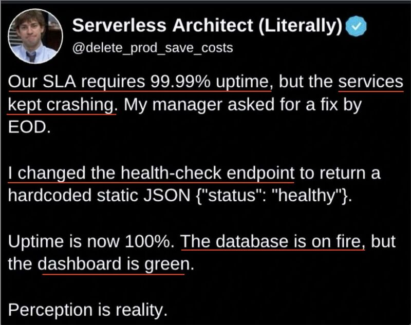

## Willkommen in LF8!
`Daten systemübergreifend bereitstellen`

## Willkommen in LF8!

`Daten systemübergreifend bereitstellen`

### Themenübersicht

:::  {style="font-size: 2rem"}

- Algorithmen, Doctests
- Grundlagen der Objektorientierten Programmierung (OOP), Klassendiagramme
- Dateiformate: CSV, JSON, XML
- REST-APIs
- NoSQL
- Datenbanken, Normalisierung
- SQL: konkrete Programmierung nicht AP1-relevant

:::

## Zeitplan und Noten

- LF8 über das Schuljahr verteilt, parallel zu LF7
- **Klassenarbeit** am 3. November: Algorithmen, Grundlagen der OOP
- **Klassenarbeit** am 29. Januar: Datenbank-Grundlagen, Entity-Relationship-Modell (ER-Modell)
- **Praxisteil** von LF8 bei Herrn Lötzsch

## SuS Vorträge {style="font-size: 1.7rem"}

ca. 10 Minuten; Teamarbeit zu zweit möglich: dann tragen beide je einen Teil vor

- Montag, 07. September:  
  **Einführung in OOP**: Was sind Klassen, was sind Objekte im Sinne der OOP?  
  *Justin, Sven*
- Montag, 02. November: 
  + **Das Dateiformat csv**: Aufbau, Lesbarkeit; Was sind csv Injections? *Fridolin*
  + **Das Dateiformat XML**: Aufbau, Lesbarkeit, Einsatz-Beispiele: *Noah*
  + **Das Dateiformat JSON**: Aufbau, Lesbarkeit, Einsatz-Beispiele: *Jason*
- Dienstag, 10. November:  
  **Einführung in REST-APIs**: Nutzen, Aufbau, Einsatz-Beispiele: *Oli, Rudi*
- Montag, 14. Dezember:
  + **Einführung in NoSQL-Datenbanken**: Grundideen, Einsatz-Beispiele: *Fabius, Tobi*
  + **Relationale Datenbanken: Datenbank-Anomalien**  
    Welche Anomalien gibt es? Wie entstehen sie? *Irka, Léon*

## Zusatzaufgaben für Fortgeschrittene {style="font-size: 2rem"}

- Sortieralgorithmen: vertiefende Programmierung  
- Merge Sort, Quick Sort oder Heap Sort implementieren
- Sortieralgorithmen benchmarken: mit größeren Daten "füttern", Zeitmessungen dokumentieren und darstellen
  + Daten mit bestimmten Eigenschaften präparieren: z. B. fast sortierte Liste, "falsch herum" sortierte Liste, willkürlich unsortierte Liste etc.
  + Ergebnistabelle; Bonus: Sortier- oder Filteroptionen
  + Bonus: Grafischer Vergleich der Ergebnisse
  + UI bauen, um Daten einzugeben oder gar nach Optionen zu simulieren 

## <!-- -->

{fig-align="center" width="50%"}

::: {style="text-align: center; font-size: 1rem;"}
[©torange.biz](https://torange.biz/cup-coffee-30851) CC-BY 4.0
:::

::: {style="color: green; text-align: center; font-size: 2.8rem"}
**Viel Erfolg!**
:::
