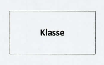
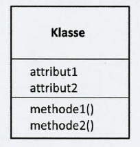
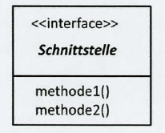
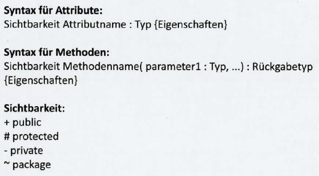

## Ziele

Grundpfeiler der objektorientierten Programmierung (OOP) verstehen und anwenden können:

- Kapselung, Vererbung, Polymorphie, Interfaces
- UML-Notation
- Zugriffsmodifikatoren
- Einführung in Pseudocode mit OOP-Konzepten


## OOP: Was ist eine Klasse?

::: {.incremental style="font-size: 2rem"}

- Eine Klasse ist ein **Bauplan für die Erstellung von Objekten.**
- Klasse definiert Attribute und Methoden eines Objekts
  + Attribute: Eigenschaften, Variablen; repräsentieren den **Zustand**
  + Methoden: Funktionen; repräsentieren das **Verhalten**
- Klasse ermöglicht Erstellung **mehrerer Objekte mit ähnlichen Merkmalen und Verhaltensweisen**
:::

::: notes
Lernkarten AP2 2025 Nr. 137
:::


## OOP: Was ist ein Objekt?

::: {.incremental style="font-size: 2rem"}

- eine konkrete Instanz einer Klasse
- besitzt die Attribute und Methoden, die in seiner Klasse definiert sind
- **Jedes Objekt hat seinen eigenen Satz von *Werten* für die Attribute**.
- Attribute -> Zustand des Objekts
- Methoden -> Verhalten des Objekts, das auf diesem Zustand operiert
- **Ein Objekt ist eine Verkapselung von Daten (Zustand) und den dazu gehörenden Operationen (Verhalten).**
:::

::: notes
Lernkarten AP2 2025 Nr. 140
:::


## OOP: Grundideen

- Kapselung *(Encapsulation)*
- Vererbung
- Polymorphie
- Interfaces


## OOP: Kapselung *(Encapsulation)*

::: {.incremental style="font-size: 1.9rem"}

- interne Daten eines Objekts werden vor direktem Zugriff geschützt
- Zugriff erfolgt über definierte Methoden (Getter/Setter)
- Zugriffsmodifikatoren steuern die Sichtbarkeit:  
  *public, private, protected, package*
- schafft **Datenintegrität**: Manipulation nur auf sichere, kontrollierte Weise
- verbessert **Wartbarkeit**: Änderungen an der internen Implementierung der Klasse beeinflussen nicht die Programmteile, die die Klasse verwenden
:::

::: notes
Lernkarten AP2 2025 Nr. 134
:::


## OOP: Kapselung - Zugriffsmodifikatoren

::::: {style="font-size: 1.8rem"}
Zugriffsmodifikatoren bestimmen, wo auf Klassen, Methoden und Variablen zugegriffen werden kann.

:::: columns
::: {.column width="40%"}

Zugriffs-<br>modifikator | Symbol |
--------------------|----------|
`public` <br> &nbsp; | + |
`private` <br> &nbsp; | - |
`protected` <br> &nbsp; | # |
`package` | ~ |
:::

::: {.column .fragment width="60%"}

| Bedeutung <br> &nbsp; |
|-----------|
| Zugriff **überall** erlaubt, sowohl innerhalb als auch außerhalb der Klasse
| Zugriff **nur innerhalb der Klasse** erlaubt, in der sie definiert sind
| Zugriff nur innerhalb der Klasse, des Pakets und von abgeleiteten Klassen erlaubt
| Zugriff ist innerhalb der Klasse und in allen Klassen desselben Pakets erlaubt
:::
::::
:::::

::: notes
Lernkarte AP2 2025 Nr. 142
:::


## OOP: Kapselung - Zugriffsmodifikatoren

::::: {style="font-size: 1.8rem"}

#### IHK-Standard in Prüfungen

Zugriffs-<br>modifikator | Symbol | Bedeutung | Verwendung
:-----|:---:|:-----------|:---
`private` | - | Zugriff **nur innerhalb der Klasse** erlaubt, in der sie definiert sind | Attribute
`public` | + | Zugriff **überall** erlaubt, sowohl innerhalb als auch außerhalb der Klasse | Operation / Methode

#### UML-Beispiel

:::: columns
::: {.column .fragment width="40%"}

```
+------------------------------+
|          Konto               |
|------------------------------|
| - kontostand: double         |
|------------------------------|
| + getKontostand(): double    |
| + einzahlen(betrag: double)  |
| + abheben(betrag: double)    |
+------------------------------+
```

:::

::: {.column .fragment width="60%"}

- Niemand darf direkt auf den Kontostand (`private`) zugreifen und ihn verändern
- Veränderung nur über die `public`-Methoden `einzahlen()` und `abheben()`, die eine **Validierung** durchführen

:::
::::
:::::


## OOP: Vererbung

::: {.incremental style="font-size: 1.8rem"}

- Schlüsselprinzip: ermöglicht, neue Klassen aus bereits existierenden Klassen zu erzeugen
- eine Klasse *(Kindklasse)* kann Attribute und Methoden einer anderen Klasse *(Elternklasse)* übernehmen
- fördert **Wiederverwendbarkeit** und **Hierarchiebildung**; vermeidet **Redundanz**
- **Kindklasse** heißt auch **abgeleitete Klasse** oder **Unterklasse**
- **Elternklasse** heißt auch **Oberklasse** oder **Basisklasse**
:::

::: notes
Lernkarten AP2 2025 Nr. 133
:::


## Vererbung: Python-Beispiel

::::: {style="font-size: 2.2rem"}

```python
# Elternklasse = Basisklasse = Oberklasse

class Haustier:
    def __init__(self, name):
        self.name = name
        self._energie = 100  # Unterstrich: 
        # Konvention für geschütztes Attribut

    def spielen(self):
      ...
```

```python
# Kindklasse = abgeleitete Klasse = Unterklasse

class Hund(Haustier):
    pass    # erbt alles unverändert
```

::: fragment

```python
# Anwendung

bello = Hund("Bello")
bello.spielen()   # nutzt die geerbte Methode
```

:::
:::::


## Vererbung: UML

:::: columns
::: {.column style="font-size: 1.8rem"}

```
+----------------------------+
|       Fahrzeug             |
|----------------------------|
| # marke: String            |
| # baujahr: int             |
|----------------------------|
| + beschreibung(): String   |
+----------------------------+
         ^            ^
         |            |
    erbt von      erbt von
         |            |
+----------------+  +--------------------+
|     PKW        |  |       LKW          |
|----------------|  |--------------------|
| - anzahlSitze  |  | - ladekapazitaet   |
|----------------|  |--------------------|
| + beschreibung |  | + beschreibung()   |
+----------------+  +--------------------+
```

:::

::: {.column .fragment}

- `PKW` und `LKW` erben von `Fahrzeug`
- Beide übernehmen die `protected`-Attribute `marke` und `baujahr`
- Beide erhalten jeweils ein eigenes privates Attribut (`anzahlSitze` bzw. `ladekapazität`)

:::
::::


## Vererbung: Begriffe

::: {style="font-size: 1.8rem"}

- **Oberklasse (Superklasse)** – Klasse, von der geerbt wird
- **Unterklasse (Subklasse)** – Klasse, die erbt
- **super** – Zugriff auf Methoden/Konstruktor der Oberklasse
- **Ist-ein-Beziehung** – PKW ist ein Fahrzeug (Vererbung)
- **Hat-ein-Beziehung** – Fahrzeug hat einen Motor (Komposition, keine Vererbung; wird später vertieft)

- Durch Vererbung müssen gemeinsame Attribute (marke, baujahr) und Methoden nur einmal in der Elternklasse definiert werden.
- Kindklassen fügen spezifische Attribute hinzu und können Methoden überschreiben.

:::


## OOP: Polymorphie ("Vielgestaltigkeit")

:::: {style="font-size: 1.8rem"}

**Definition:** Polymorphie (Vielgestaltigkeit) bedeutet, dass Objekte verschiedener Klassen über eine gemeinsame Schnittstelle angesprochen werden können und sich **unterschiedlich verhalten**.

::: incremental

- Wie wird das unterschiedliche Verhalten der Objekte ausgelöst?  
  durch den **Datentyp** oder die **Klasse**
- Klassen teilen Methoden, aber die **Implementierungen** der Methoden können variieren
- Wann wird entschieden, welche Implementierung ausgeführt wird? Zur Laufzeit! Tatsächlicher Objekttyp entscheidet
- verbessert **Flexibilität**
- erhöht **Wiederverwendbarkeit von Code**
- erleichtert **standardisierte Schnittstellen**

:::
::::

::: notes
Lernkarten AP2 2025 Nr. 141
:::


## Polymorphie: Zwei Arten

<br>

::: {style="font-size: 1.8rem"}

| Art | Beschreibung | Beispiel |
|:---|:---------|:-----|
| Überladen (*Overloading*) | Gleicher Methodenname, verschiedene Parameter | `berechne(a)` und `berechne(a, b)` |
| Überschreiben (*Overriding*) | Kindklasse überschreibt Methode der Elternklasse | `Hund.sprechen()` statt `Tier.sprechen()` |

:::


## OOP: Schnittstellen *(Interfaces)*

- definieren, **welche** Methoden eine Klasse implementieren muss
- lassen offen, **wie**
- ermöglichen lose Kopplung und Austauschbarkeit von Komponenten


## Schnittstellen: UML-Notation

::: {style="font-size: 1.8rem"}

```
+-------------------+
| <<interface>>     |
| Druckbar          |
|-------------------|
|                   |
|-------------------|
| + drucke(): void  |
+-------------------+
        ^
        |
  implementiert
        |       
+-------------------+
| Rechnung          |
|-------------------|
| + drucke(): void  |
+-------------------+
```

:::


## Klassendiagramm

:::: columns
::: column




:::

::: column



:::
::::



::: notes
Quelle: Belegsatz zu AP2, Sommer 2026
:::


## Klassendiagramm: Beispiel

#### Vererbung & Polymorphie: UML

::: {style="font-size: 1.8rem"}

```
+----------------------------+
|         Haustier           |
|----------------------------|
| - name : String            |
| - energie : int           |
|----------------------------|
| + spielen() : void         |
| + ausruhen() : void        |
+----------------------------+
         ^            ^
         |            |
         |            |
+----------------+  +----------------+
|      Hund      |  |     Katze      |
|----------------|  |----------------|
| + spielen()    |  | + spielen()    |
+----------------+  +----------------+
```

:::


## Klassendiagramm: Erläuterung

:::: {style="font-size: 1.8rem"}

Das **Klassendiagramm** zeigt Klassen, ihre Attribute und Methoden sowie Beziehungen zwischen Klassen.

::: incremental 
- **Klassen und Objekte:** Welche Klassen gibt es und welche Objekte repräsentieren sie?
- **Attribute und Operationen:** Welche Eigenschaften und Verhaltensweisen haben die Klassen?
- **Beziehungen:** Wie sind die Klassen miteinander verknüpft (z. B. durch Assoziationen und Vererbungen)?
- **Sichtbarkeit:** Welche Attribute und Operationen sind öffentlich, privat oder geschützt?
- **Kardinalität:** Wie viele Instanzen einer Klasse können mit einer anderen in Beziehung stehen?
:::
::::

::: notes
Lernkarten AP2 2025 Nr. 131
:::


## <!-- -->

{fig-align="center" width="50%"}

::: {style="color: green; text-align: center; font-size: 2.8rem"}
**Viel Erfolg!**
:::
